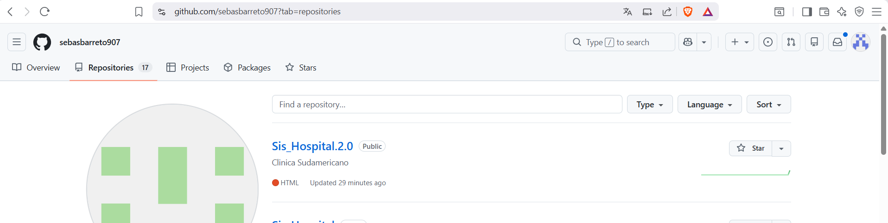
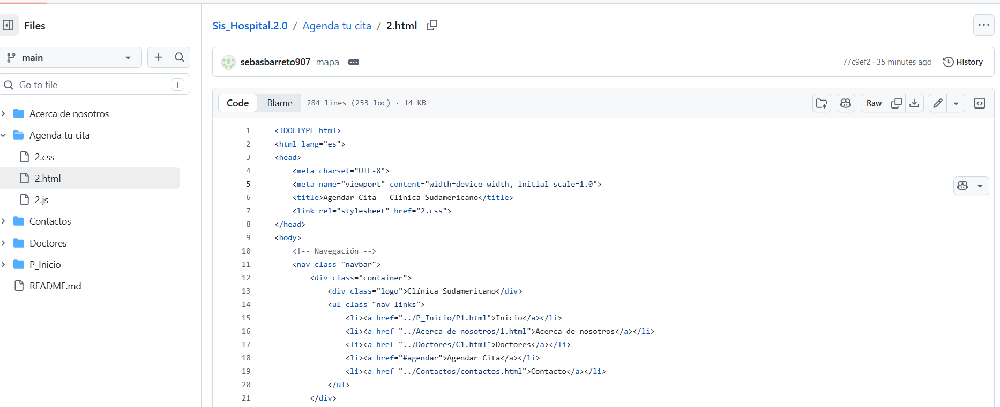
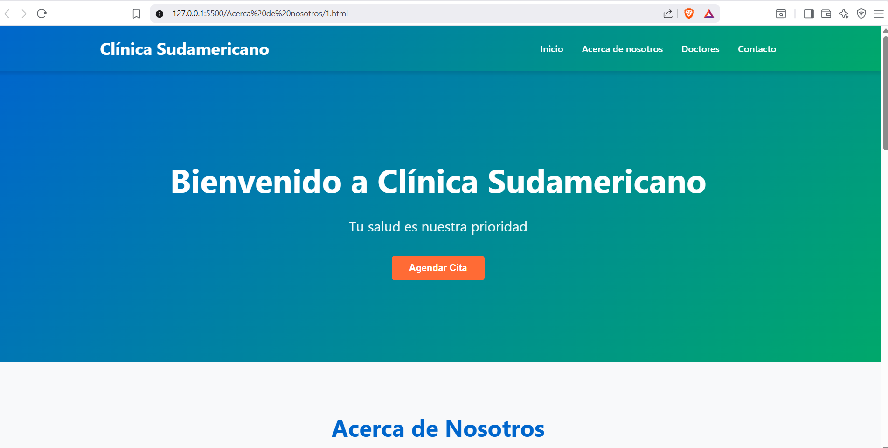

## Background

Durante el desarrollo de este proyecto se adquirieron conocimientos fundamentales sobre el trabajo colaborativo en entornos de desarrollo de software utilizando repositorios compartidos. El equipo aprendió a gestionar tareas y organizar actividades mediante el uso de **Projects**, lo que permitió planificar el trabajo, asignar responsabilidades y dar seguimiento al progreso de cada integrante.

**evidencia**

se crea el proyecto y nos dieron a cada integrante una tarea establecida 
-----

## issues
 se emplearon Issues para documentar errores, registrar mejoras y coordinar la resolución de problemas de manera estructurada. Esta herramienta facilitó la comunicación entre los miembros del equipo y permitió mantener un historial claro de las actividades realizadas durante el desarrollo.

 **evidencia**

 

 en este issues mi aporte fue agregar al sitio web. la parte con respecto al agendamiento de citas 

 -----

# CONCLUSION

Como resultado, el proyecto permitió desarrollar competencias técnicas y de trabajo en equipo, destacando el valor de las herramientas de gestión y control de versiones en proyectos de desarrollo de software modernos.

 **Evidencia**

 

 *en esta imagen se visualiza el trabajo final de lo que se obtuvo al trabajar en conjunto en este proyecto*

 

 -----