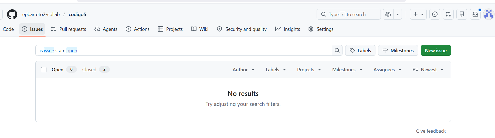
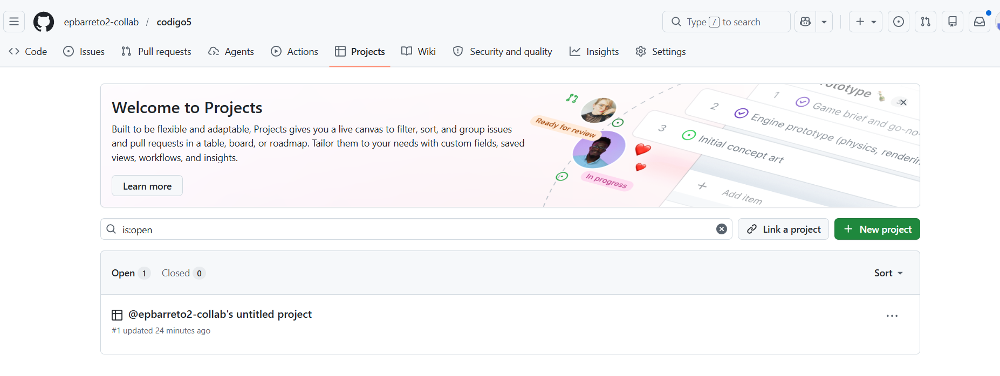
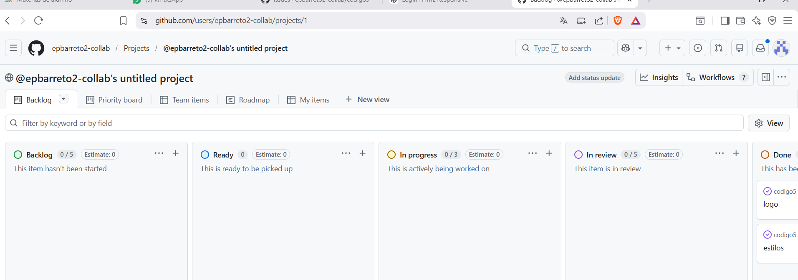

# Lo que hicimos en el curso de actualizacion de github (DIA2)
---

*Nos indico en por que es efectivo usar issues, los cuales sirven para agregar tareas para un mienbro del equipo de trabajo en especifico.*

# Project
----
*Es un espacio donde se puede organizar las actividades para cada integrante y sus actividades a realzar*
###ejemplo de project

# Kanban
---
*Es una metodologia visual donde se puede ver los avances los pendientes y lo realizado* 
##ejemplo##
